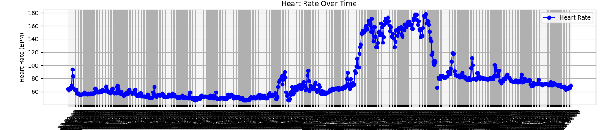
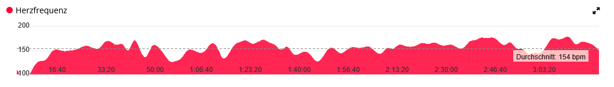

# Garmin TCX HeartRate Merger
A tool to merge passively collected Garmin watch heart rate data with recorded cycling-computer activity, aligning and interpolating missing values using Cubic Spline to generate a unified TCX file.
## Purpose
This Repository searches as a collection of scripts to merge Garmin Hearthrate data with a recorded activity.
A situation like this might occure when you track your activity using a Garmin cycling-computer while wearing a Garmin watch, that "passively" records your heartrate.

## Goal
The goal is to merge the heartrate data from the watch with the activity data from the cycling-computer into a single TCX file.

Example heartrate data collected by the watch over a full day:


Heartrate mapped to the activity data and interpolated using Cubic Spline:

## Usage
### Prerequisites
- Python 3 is installed
- Obtain the heartrate data from the watch as a .json file. This can be done by exporting the activity from the Garmin Connect website. Curently, the heartrate data can only be obtained manually. Navigate to https://connect.garmin.com/modern/heart-rate/2025-02-23/0 (replace with your activity date), open the deveoper console (F12), go to network tab, reload the page and search for ``dailyheartrate`` in the network requests. Go to the response tab and copy the `heartRateValues` value. Finally, save the value to a .json file.
- Obtain the activity data from the cycling-computer as a .tcx file. This can be done by exporting the activity from the Garmin Connect website.
- Run `python mergeHR2tcx.py` with the parameters:
````
positional arguments:
  original_tcx  The original TCX file
  hr_json       The heart rate JSON file
  output_tcx    The final output TCX file
````

### Example
`python mergeHR2tcx.py activity_18356238873.tcx hr.json updated_activity_18356238873.tcx`

Output:
````
### Step 1: Converting TCX to CSV ###
Original TCX file converted to CSV format as activity.csv

### Step 2: Adding Heart Rate Data ###
Searching timestamps from 589 heartrate data points.
Added approx. 8 heart rate data points to activity.
CSV file updated and saved as updated_activity.csv

### Step 3: Interpolating Missing Heart Rate Data ###
Interpolated 2938 missing heart rate data points.
Final CSV file with interpolated heart rates saved as final_activity.csv

### Step 4: Converting CSV Back to TCX ###
Header written
Trackpoints written
Footer written
Recreated TCX file saved as updated_activity_18356238873.tcx

### Done! Final TCX file saved as updated_activity_18356238873.tcx ###
````


See `python addHR2tcx.py --help` for more information.

## How it works
1. The original TCX file is converted to a CSV file.
2. The heartrate data from the JSON file is converted from JSON to python dictionary.
3. The timetamps of the heartrate data are converted from unix timestamps to iso timestamps.
4. The iso-timestamps are truncated to remove seconds, as the watch passivly only reports the heartrate every 2 minutes.
5. The timestamps are matches with the timestamps of the activity data.
6. The heartrate data is added to the CSV file.
7. Missing heartrate data is interpolated using [Cubic Spline](https://mathworld.wolfram.com/CubicSpline.html) and added to the CSV, see `interpHR.py` for the interpolation implementation.
8. The CSV file is converted back to TCX. The original XML headers and footers are copied to the new TCX file, keeping the metadata intact.

## Acknowledgements
Thanks to [coreysiegel](https://github.com/coreysiegel/tcx-gpx-csv) for the original TCX to CSV conversion script.
